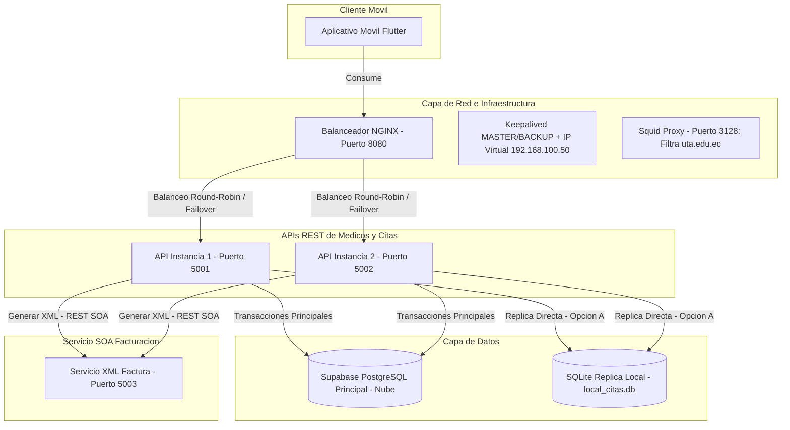

# MediCitas 360 - Sistema Distribuido de Agendamiento Médico, Facturación y Control de Acceso

Este proyecto es la solución completa para la **Prueba Final Práctica de Aplicaciones Distribuidas**. MediCitas 360 es un ecosistema distribuido que integra un aplicativo móvil, APIs REST balanceadas localmente, replicación en base de datos local y en la nube, y servicios de facturación XML independientes basados en SOA.

---

## 1. Arquitectura del Sistema



---

## 2. Estructura de Directorios

- `api/`: Código base para la API REST (Flask) que corre en los puertos `5001` y `5002`. Maneja la persistencia y la réplica local.
- `facturacion/`: Servicio de facturación SOA independiente (Flask) que corre en el puerto `5003`. Genera el comprobante XML y lo almacena localmente.
- `mobile_app/`: Aplicativo móvil multiplataforma desarrollado en Flutter. Consume el balanceador.
- `nginx/`: Archivo de configuración `nginx.conf` para balancear peticiones entre API 1 y API 2.
- `keepalived/`: Configuraciones MASTER y BACKUP de Keepalived para failover del portal web.
- `squid/`: Archivo de configuración de Squid para restricción de navegación.
- `databasesupabase/`: Contiene el script `database.sql` para el setup de la base de datos de Supabase.

---

## 3. Puertos Utilizados

| Servicio | Puerto | Descripción |
| :--- | :--- | :--- |
| **API 1** | `5001` | Instancia Principal de la API REST de Médicos y Citas |
| **API 2** | `5002` | Instancia Secundaria (Failover/Balanceo) |
| **NGINX** | `8080` | Balanceador de Carga Local |
| **Facturación XML** | `5003` | Servicio SOA de Facturación independiente |
| **Squid Proxy** | `3128` | Proxy de Restricción de navegación |
| **IP Virtual (Web)** | `192.168.100.50` | IP Virtual gestionada por Keepalived para el Portal |

---

## 4. Instrucciones de Ejecución

### Requisitos Previos
- Python 3.10 o superior instalado.
- Flutter SDK instalado y configurado.
- NGINX instalado.

---

### Paso 1: Configurar la Base de Datos Principal (Supabase)
Las tablas y datos iniciales de prueba ya se han creado y poblado en la base de datos de Supabase. Si desea recrearlas, puede ejecutar el script en `databasesupabase/`:
```bash
cd databasesupabase
python run_schema.py
```

---

### Paso 2: Iniciar el Servicio de Facturación SOA (Puerto 5003)
1. Instale las dependencias de la API si no lo ha hecho:
   ```bash
   pip install flask
   ```
2. Inicie el servidor de facturación:
   ```bash
   cd facturacion
   python app.py
   ```
   *El servicio iniciará en `http://localhost:5003`.*

---

### Paso 3: Iniciar las Dos Instancias de la API REST (Puertos 5001 y 5002)
Abra dos terminales separadas para ejecutar las dos instancias del mismo código base:

**Instancia 1 (Puerto 5001):**
```bash
cd api
$env:PORT="5001"
python app.py
```

**Instancia 2 (Puerto 5002):**
```bash
cd api
$env:PORT="5002"
python app.py
```
*Ambas instancias utilizarán y sincronizarán la base de datos central en Supabase y escribirán de forma local en la réplica SQLite `local_citas.db` de su respectivo entorno.*

---

### Paso 4: Configurar e Iniciar el Balanceador NGINX (Puerto 8080)
1. Copie el archivo `nginx/nginx.conf` a la carpeta de configuración de su instalación de NGINX (por ejemplo, `/etc/nginx/` o `C:\nginx\conf\`).
2. Inicie o recargue NGINX:
   ```bash
   nginx -s reload
   ```
3. Ahora las peticiones realizadas a `http://localhost:8080` se distribuirán automáticamente entre el puerto 5001 y 5002.

---

### Paso 5: Iniciar el Aplicativo Móvil Flutter
1. Navegue al directorio del aplicativo:
   ```bash
   cd mobile_app
   ```
2. Obtenga los paquetes necesarios:
   ```bash
   flutter pub get
   ```
3. Ejecute el aplicativo en el dispositivo o emulador de su preferencia:
   ```bash
   flutter run
   ```
   *Nota: Por defecto, el aplicativo apunta a `http://localhost:8080`. Puede cambiar esta configuración dinámicamente desde el menú de Configuración (Icono de engranaje) en la esquina superior derecha de la aplicación móvil (ej. cambiar a `http://10.0.2.2:8080` si usa el emulador de Android).*

---

### Paso 6: Configurar Squid Proxy (Puerto 3128)
Para aplicar las restricciones de navegación y permitir únicamente `uta.edu.ec`:
1. Copie el archivo `squid/squid.conf` en la ruta de configuración de Squid (por ejemplo `/etc/squid/squid.conf`).
2. Reinicie el servicio de Squid:
   ```bash
   sudo systemctl restart squid
   ```

---

### Paso 7: Configurar Keepalived e IP Virtual (Portal Web)
1. Instale `keepalived` en sus servidores web principal y respaldo:
   ```bash
   sudo apt-get install keepalived
   ```
2. Copie `keepalived/keepalived-master.conf` al servidor principal como `/etc/keepalived/keepalived.conf`.
3. Copie `keepalived/keepalived-backup.conf` al servidor respaldo como `/etc/keepalived/keepalived.conf`.
4. Inicie Keepalived en ambos servidores:
   ```bash
   sudo systemctl start keepalived
   ```
5. El portal será accesible a través de la IP virtual `http://192.168.100.50`. Si el servidor principal falla, el respaldo tomará control de la IP virtual sin interrupciones.

---

## 5. Pruebas y Evidencias de los Componentes

### Componente 7: Seguridad mediante Token
- **Petición con token correcto**: Cabecera `Authorization: Bearer medicitas2026`. Se puede simular seleccionando "Correcto" en el aplicativo móvil.
- **Petición con token incorrecto**: Retorna `{ "error": "Token no válido o no autorizado" }` y estado `401`. Simular seleccionando "Incorrecto".
- **Petición sin token**: Retorna el mismo error. Simular seleccionando "Sin Token".

### Componente 10: Réplica Local (Opción A y B)
- **Opción A (Réplica directa)**: Al guardar una cita en `POST /api/citas`, la API escribe automáticamente en Supabase y replica el registro en el archivo SQLite local `api/local_citas.db`.
- **Opción B (Sincronización)**: El endpoint `POST /api/sincronizar` permite descargar y resincronizar en lote los datos de citas y facturas desde la nube Supabase hacia la base local SQLite.
- **Alta Disponibilidad**: En el listado de citas, puede apagar la conexión a internet (o alterar los datos de conexión) y activar el toggle "Replica Local" en el app móvil. El aplicativo continuará leyendo las citas desde SQLite local sin detenerse.
